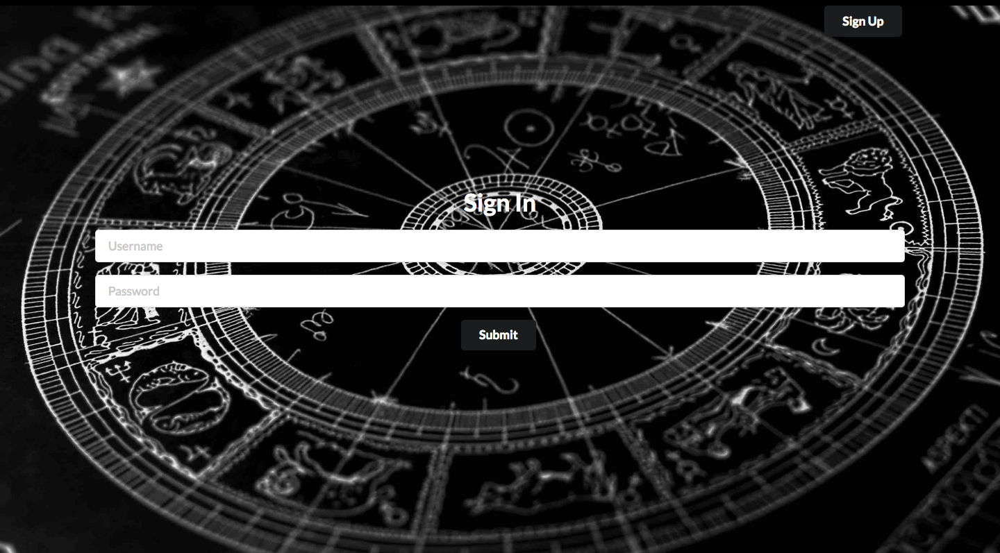
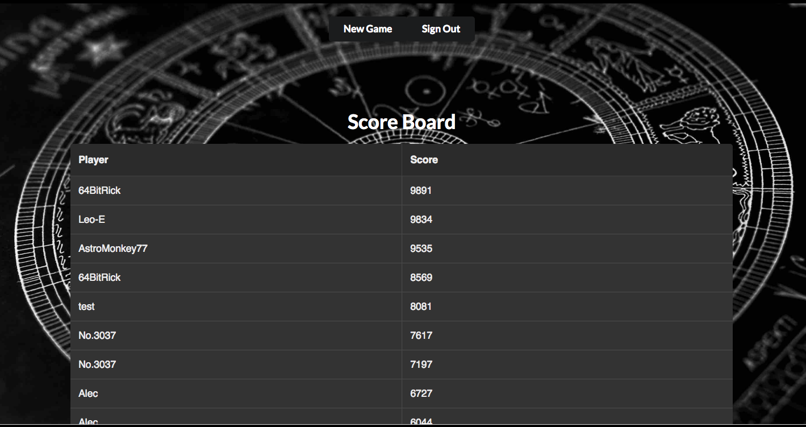
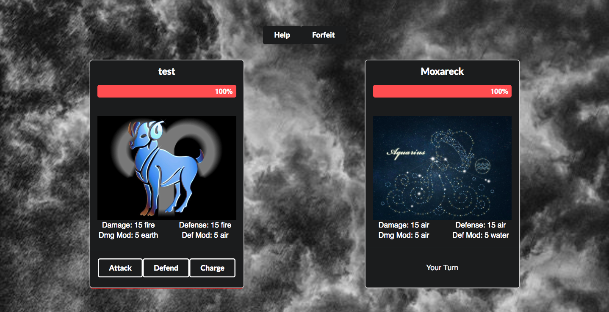

Requires:
--------------------
 * npm 3.10.10 or greater

Instuctions:
---------------------

First make sure the backend is running properly.

The backend can be fond at this repo: https://github.com/alec-horwitz/AstrologyBrawl-Back

Then fork this repository and clone it to your computer.

Open up a terminal window, navigate to the directory this read me resides in and run the following commands:

 * npm install
 * npm start

npm will try to run on port 3000 but if you followed the instruction properly the backend should already be running on that port. As such when npm asks if you'd like to run on a different port answer "y" for yes.

If you start the frontend before the backend ruby will not be so helpful in finding another port to start on for you. This is why you must start the backend first.

Here is an account you can use to test the code:

Username: test

Password: test

When the app runs for the first time on your browser it should load the login screen which should look like this:

After you either login or create an account you will be at the scoreboard screen which should look like this:

If you click the click the new game button you will be at the battle screen which should look like this:

Here's a link to the the live version of the app if you want to try it out online: https://astrology-brawl.herokuapp.com/
